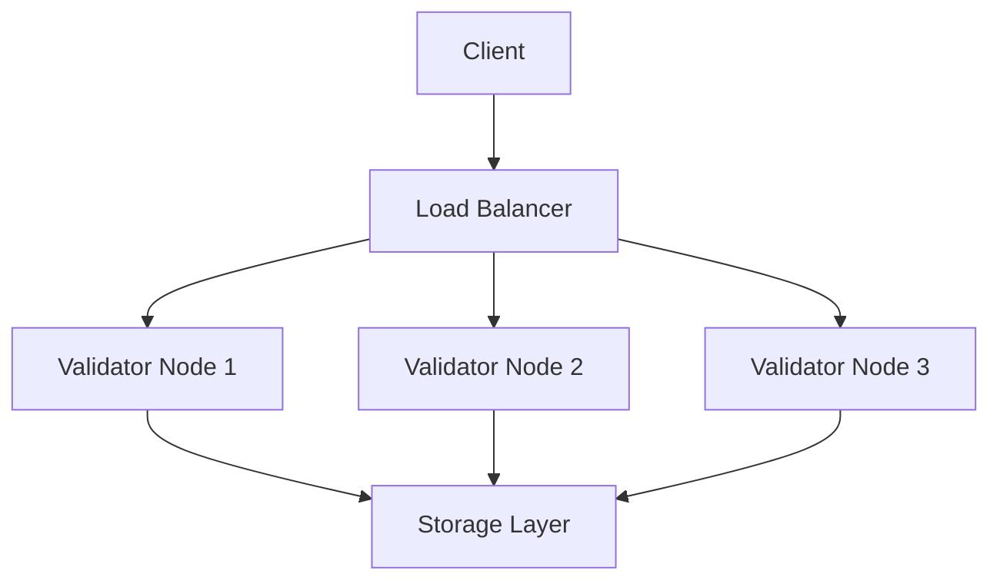

# Network Architecture

The Trunk network is designed as a distributed system for secure and efficient data validation. This document explains the core architectural concepts.

## Network Overview



## Core Components

### 1. Validator Nodes

Validator nodes are the backbone of the Trunk network:

- **Purpose**: Validate and process transactions
- **Consensus**: Proof of Stake mechanism
- **Selection**: Dynamic node selection based on stake and performance

### 2. Network Protocol

The network uses a custom protocol for communication:

```javascript
interface NetworkMessage {
  type: 'transaction' | 'validation' | 'consensus';
  payload: {
    data: any;
    signature: string;
    timestamp: number;
  };
}
```

### 3. Security Layer

Multiple security measures ensure network integrity:

- End-to-end encryption
- Multi-signature validation
- Byzantine fault tolerance
- Secure key management

## Network Topology

The network is organized in layers:

1. **Edge Layer**
   - Client connections
   - Load balancing
   - DDoS protection

2. **Validation Layer**
   - Transaction processing
   - Consensus mechanism
   - State management

3. **Storage Layer**
   - Distributed storage
   - Data replication
   - Backup systems

## Consensus Mechanism

Our consensus mechanism ensures:

1. **Agreement**
   - All valid nodes agree on state
   - Byzantine fault tolerant
   - Fast finality

2. **Validation**
   - Multi-step verification
   - Stake-weighted voting
   - Automatic dispute resolution

## Performance

Network performance metrics:

| Metric       | Target        |
|-------------|---------------|
| Latency     | &lt; 100ms    |
| Throughput  | 10k tps       |
| Finality    | 2 seconds     |
| Availability| 99.99%        |

## Network States

The network can be in various states:

```typescript
enum NetworkState {
  NORMAL,      // Regular operation
  CONGESTED,   // High load
  UPGRADING,   // Protocol upgrade
  RECOVERY     // Post-incident
}
```

## Next Steps

- [Learn about Solvers](/concepts/solvers)
- [Understand Routing](/concepts/routing)
- [Explore Privacy](/concepts/privacy)