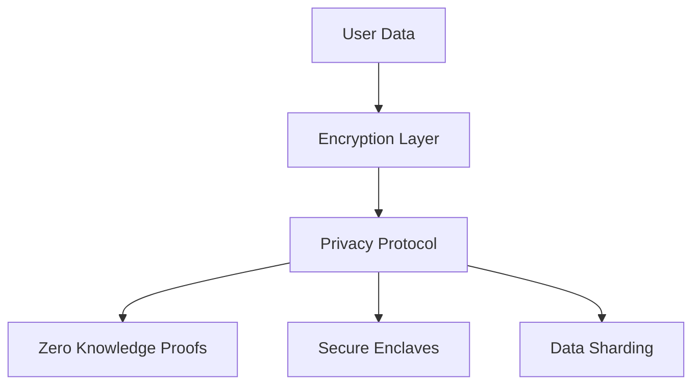

# Privacy Features

The Trunk network implements robust privacy features to protect user data and network operations.

## Privacy Overview



## Core Privacy Features

### 1. End-to-End Encryption

All network communications are encrypted:

```typescript
interface EncryptedMessage {
  payload: string;      // Encrypted data
  iv: string;          // Initialization vector
  ephemeralKey: string; // One-time key
  signature: string;    // Message signature
}
```

### 2. Zero Knowledge Proofs

Validate transactions without revealing data:

```javascript
class ZKProof {
  async generateProof(data, statement) {
    // Generate zero knowledge proof
    return {
      proof: bytes,
      publicInputs: array,
      verification: function
    };
  }
}
```

## Privacy Protocols

### 1. Data Anonymization

```javascript
class DataAnonymizer {
  static anonymize(data) {
    return {
      hash: this.hashData(data),
      merkleProof: this.generateMerkleProof(data),
      timestamp: Date.now()
    };
  }
}
```

### 2. Secure Enclaves

Protected execution environments:

```javascript
class SecureEnclave {
  constructor() {
    this.state = 'sealed';
    this.attestation = null;
  }

  async process(data) {
    // Process data in secure environment
    return {
      result: processedData,
      proof: attestation
    };
  }
}
```

## Privacy Levels

The network supports multiple privacy levels:

| Level | Description | Use Case |
|-------|-------------|----------|
| Public | Basic encryption | General transactions |
| Private | Full privacy | Sensitive data |
| Custom | Configurable | Specific needs |

## Implementation

### 1. Basic Privacy Setup

```javascript
import { TrunkPrivacy } from '@trunk/privacy';

const privacy = new TrunkPrivacy({
  mode: 'strict',
  features: ['zk-proofs', 'encryption', 'anonymization']
});

// Configure privacy settings
privacy.configure({
  encryption: {
    algorithm: 'AES-256-GCM',
    keyRotation: '24h'
  },
  anonymization: {
    level: 'maximum',
    preserveFields: ['timestamp']
  }
});
```

### 2. Privacy Middleware

```javascript
const privacyMiddleware = {
  incoming: async (data) => {
    // Decrypt and verify
    return await privacy.processIncoming(data);
  },
  outgoing: async (data) => {
    // Encrypt and sign
    return await privacy.processOutgoing(data);
  }
};
```

## Security Measures

### 1. Key Management

```javascript
class KeyManager {
  async rotateKeys() {
    const newKeys = await this.generateKeyPair();
    await this.distributeKeys(newKeys);
    return {
      status: 'rotated',
      nextRotation: Date.now() + 86400000
    };
  }
}
```

### 2. Audit Logging

Secure, privacy-preserving logs:

```javascript
class AuditLog {
  log(event) {
    return {
      hash: this.hashEvent(event),
      timestamp: Date.now(),
      proof: this.generateProof(event)
    };
  }
}
```

## Best Practices

1. **Data Handling**
   - Minimize data collection
   - Implement data expiry
   - Use secure deletion

2. **Network Security**
   - Regular security audits
   - Penetration testing
   - Vulnerability scanning

3. **Compliance**
   - GDPR compliance
   - Data sovereignty
   - Regulatory reporting

## Privacy Configuration

Example configuration:

```javascript
const privacyConfig = {
  encryption: {
    algorithm: 'AES-256-GCM',
    keyRotation: 86400, // 24 hours
    backup: true
  },
  anonymization: {
    mode: 'strict',
    preserveFields: ['timestamp', 'type'],
    saltRotation: 3600 // 1 hour
  },
  zkProofs: {
    enabled: true,
    protocol: 'groth16',
    verification: 'immediate'
  }
};
```

## Next Steps

- [Network Architecture](/concepts/network)
- [Solver System](/concepts/solvers)
- [Routing System](/concepts/routing)