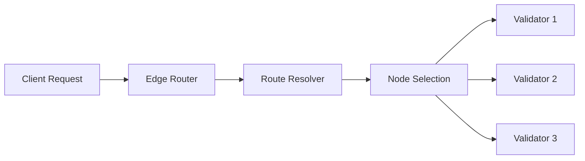

# Routing System

The Trunk network uses a sophisticated routing system to efficiently direct traffic and manage network communications.

## Routing Overview



## Core Concepts

### 1. Route Resolution

Routes are resolved using:

```typescript
interface RouteResolution {
  path: string[];
  weight: number;
  latency: number;
  hops: number;
}
```

### 2. Routing Table

Example routing table structure:

```javascript
const routingTable = {
  nodes: Map<NodeId, NodeInfo>,
  paths: Map<PathId, Path>,
  metrics: {
    latency: number,
    bandwidth: number,
    reliability: number
  }
};
```

## Routing Algorithms

### 1. Path Selection

```javascript
class PathSelector {
  selectOptimalPath(source, destination, requirements) {
    // Consider:
    // - Network latency
    // - Node capacity
    // - Geographic location
    // - Current load
    return bestPath;
  }
}
```

### 2. Load Balancing

The network implements adaptive load balancing:

- Round-robin distribution
- Weighted load balancing
- Dynamic capacity adjustment
- Geographic distribution

## Route Types

1. **Direct Routes**
   - Point-to-point connections
   - Minimal latency
   - High priority traffic

2. **Mesh Routes**
   - Multiple path options
   - Fault tolerance
   - Load distribution

3. **Broadcast Routes**
   - Network-wide distribution
   - Consensus messages
   - System announcements

## Implementation

### Basic Router Setup

```javascript
import { TrunkRouter } from '@trunk/network';

const router = new TrunkRouter({
  mode: 'dynamic',
  optimization: 'latency',
  failover: true
});

router.on('pathChange', (oldPath, newPath) => {
  console.log('Route changed:', {
    from: oldPath,
    to: newPath,
    reason: 'performance optimization'
  });
});
```

### Route Configuration

```javascript
const routeConfig = {
  priority: 'high',
  maxLatency: 100, // ms
  redundancy: 2,   // backup paths
  security: {
    encryption: true,
    verification: true
  }
};
```

## Performance Optimization

### 1. Caching

```javascript
class RouteCache {
  constructor() {
    this.cache = new Map();
    this.ttl = 60000; // 1 minute
  }

  get(path) {
    return this.cache.get(path);
  }

  set(path, route) {
    this.cache.set(path, {
      route,
      timestamp: Date.now()
    });
  }
}
```

### 2. Metrics Collection

| Metric      | Description        | Target     |
|-------------|-------------------|------------|
| Latency     | Round-trip time   | &lt; 50ms   |
| Bandwidth   | Available capacity | &gt; 100Mbps|
| Reliability | Uptime percentage | 99.9%      |

## Error Handling

Common routing issues and solutions:

### Network Partitions
```javascript
async function handlePartition(partition) {
  // Detect partition
  // Reroute traffic
  // Notify affected nodes
  // Attempt recovery
}
```

### Node Failures
```javascript
async function handleNodeFailure(node) {
  // Remove from routing table
  // Update affected routes
  // Notify dependent nodes
  // Begin recovery process
}
```

## Best Practices

1. **Regular Updates**
   - Update routing tables frequently
   - Monitor network conditions
   - Adjust weights dynamically

2. **Security**
   - Verify route authenticity
   - Encrypt route updates
   - Monitor for anomalies

## Next Steps

- [Network Architecture](/concepts/network)
- [Solver System](/concepts/solvers)
- [Privacy Features](/concepts/privacy)