## The Problem with Traditional MCPs

Today's model-context protocols (MCPs) are noisy and fragmented. Each new capability, like fetching a token price, adding a calendar event, or summarizing a news feed,requires manually locating a plug-in, importing its schema, wiring credentials, and handling everything from rate limits to response formats.

> Agents end up dragging a backpack of bespoke dependencies just to answer a single follow-up question.

### Example: A Simple Query
_“What’s the current price of SOL and how does it compare to yesterday?”_

Becomes four manual chores:

| Step                     | Pain Point                              |
|--------------------------|------------------------------------------|
| Install price API tool   | Version clashes, API changes            |
| Configure API keys       | Secret management, rotation             |
| Parse response/timestamps| Glue code, edge cases                   |
| Rate-limit & cache       | Extra infra, stale data risk            |

**Result:** More scaffolding than intelligence.

<CardGroup cols={2}>
  <Card
    title="Get Started"
    icon="rocket"
    href="/quickstart"
  >
    Deploy a Trunk runtime and see the difference.
  </Card>
  <Card
    title="Explore Concepts"
    icon="book"
    href="/docs/concepts"
  >
    Learn the core ideas behind Trunk’s design.
  </Card>
</CardGroup>

## Runtime Architecture

```mermaid
flowchart TD
    Agent["Agent"] --> SDK["Trunk SDK"]
    SDK --> Router["Trunk Router"]
    Router -->|public data| Chain["On-chain log"]
    Router -->|private intents 🔒| Local["Local Intent Runner"]
    Router --> Manager["• Batch Manager"]
    Router --> Consensus["• Consensus Verifier"]
```

## Execution Flow

Agents embed a tiny SDK (~x kB). Each MCP call is automatically routed:

- Public data → sent to Trunk's batch manager and published on-chain.
- Private intents → executed locally and committed as hashed records.

No extra imports. One async response.

<CardGroup cols={2}>
  <Card
    title="Explore the SDK"
    icon="code"
    href="/trunk/trunk"
  >
    Learn how to install and invoke Trunk in your codebase.
  </Card>
  <Card
    title="Run a Local Runtime"
    icon="server"
    href="/dev/quickstart"
  >
    Deploy a client-side instance for handling private actions.
  </Card>
</CardGroup>

